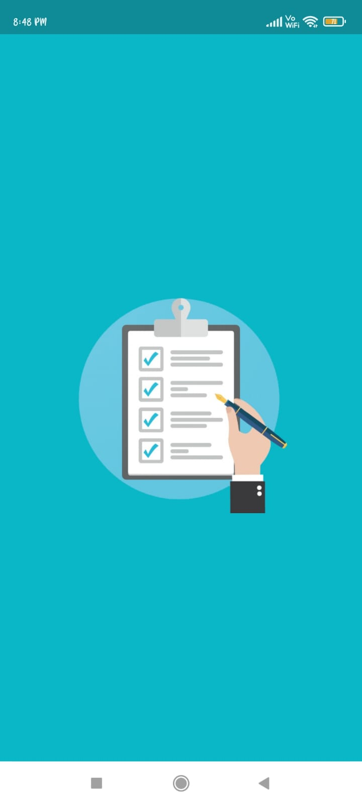
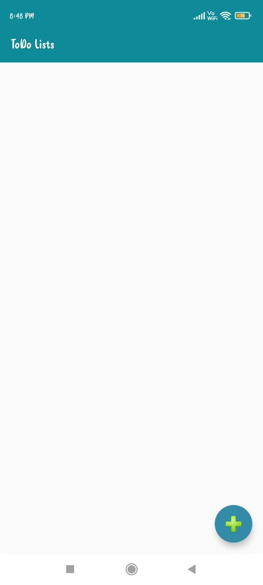
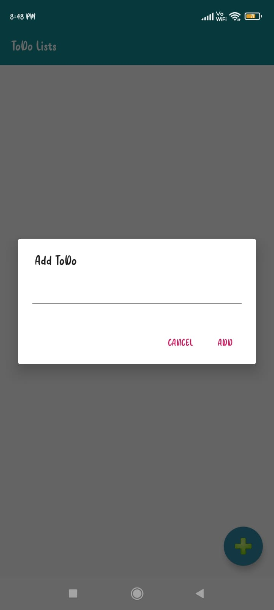
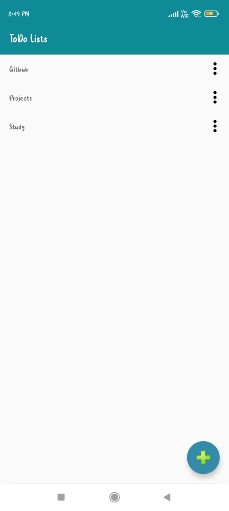
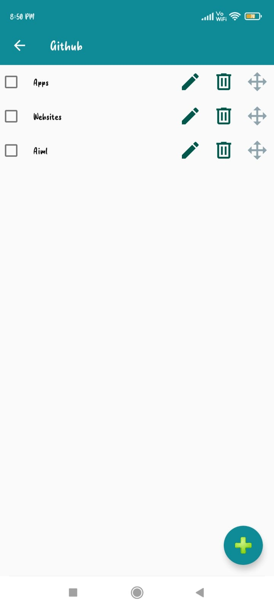
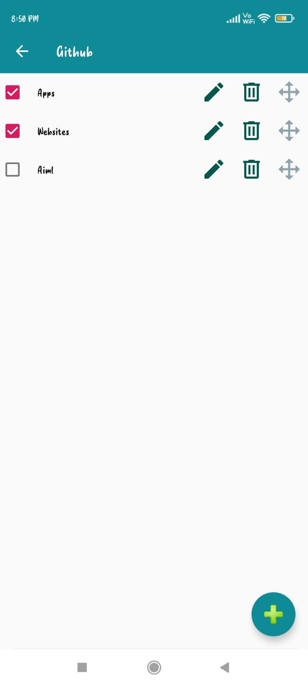
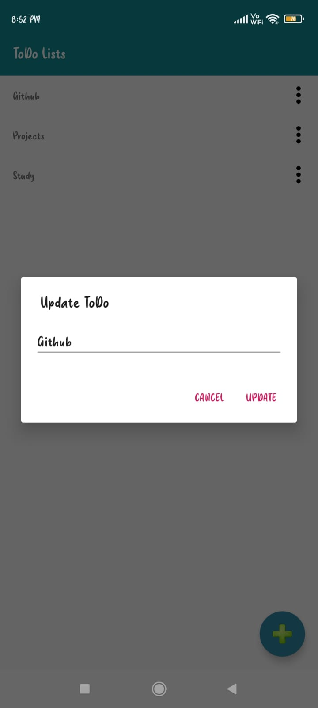
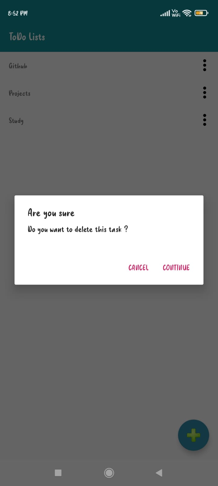
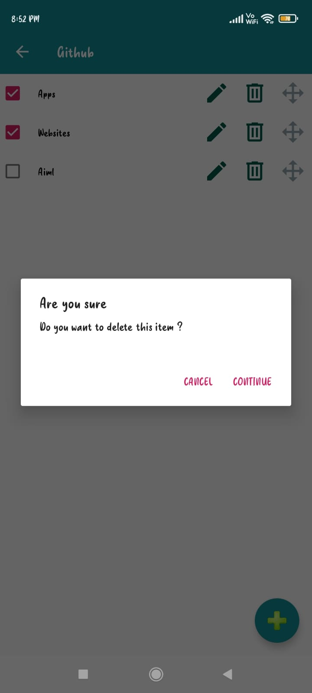

# TodoList_App :star_struck: 

        

***This new android application named 'TODO-LIST APP' is created by Biswarup Bhattacharjee, student of BTECH, in University of Engineering and Management, Kolkata.***

**Email Id: bbiswa471@gmail.com.** 

**Contact No: 916290272740.** 

## About :point_down: 

 
This todolist is created using kotlin for android mobile phones. In this app user can add lists of works to do. That work can be edited, deleted, marked as complete, reset. Such a plenty of options user gives comfotable space to listout works. Here user can also add sub-tasks ineach todo. For each sub-task there are option to edit, delete. Also sub-tasks can be placed according to our choice. We can set the list as we want. Like these the tasks and sub-tasks helps us maintaining our tasks as per our schedule or due date. This todolist android app is very easy to use and also it is easy to maintain the tasks.

## APP DOWNLOAD LINK : :point_right: <a href="https://drive.google.com/file/d/1EjOehwi_eCX_g2wEvOzLFQPeJwvuVMMU/view" download>Click here to download</a>

## Purpose :point_down:

       
I have made this todolist android app to maintain my tasks and also for other user's tasks. This app can be easily used in our phone any time.
 

       
## Importance :point_down:

One of the most important reasons we should use a to do list is that it will help us stay organised. When we write all your tasks in a list, they seem more manageable. When we’ve got a clear outline of the tasks we’ve got to do and those we’ve completed, it helps us stay focused. While freeing up space in our mind for other more creative tasks.
When we complete a task, you can cross it off our list. This gives you a sense of progress and achievement, something we’ll lack if we’re always rushing from one task to the next. If we feel a sense of achievement, it spurs us on and motivates us to keep moving forward.
 

## Folder Structure :point_down:
           
## Making :point_down:

I have this app using kotlin.
 

## Screenshots :point_down: 

  
  
 
  

  
       

